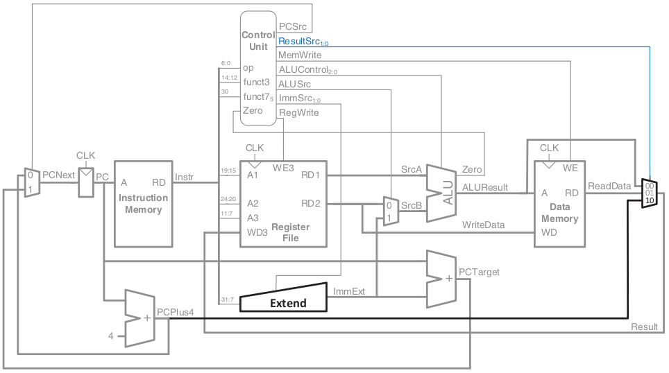

# riscv-processor

## Overview
It is intended to build a single cycle RISC-V processor, based on the given diagram:\


## Tools
- Xilinx Vivado 2019.02
- [Online RISC-V Interpreter](https://www.cs.cornell.edu/courses/cs3410/2019sp/riscv/interpreter/)
- [Online RISC-V Assembler](https://riscvasm.lucasteske.dev/#)

## Setup
Firstly, clone the repo:
```
$ git clone git@github.com:TomasLAbreu/riscv-processor.git
$ cd riscv-processor/
```
Create the single-cycle-risc-v processor Vivado project:
```
$ cd single-cycle-risc-v/
$ vivado &
```
When Vivado opens, go to `Tools > Run Tcl Script...` and run **create_proj.tcl**.
**Enjoy**!

## Support Documents
- [RISC-V Instruction Set Manual](https://github.com/TomasLAbreu/riscv-processor/blob/main/doc/riscv-spec-20191213.pdf)
- [RISC-V Instruction Set Summary](https://github.com/TomasLAbreu/riscv-processor/blob/main/doc/RISC-V-Instruction-Set-Summary.pdf)
- [RISC-V Reference Card](https://github.com/TomasLAbreu/riscv-processor/blob/main/doc/RISC-V_referenceCard.pdf)
- [Digital Design and Computer Architecture RISC-V Edition](https://github.com/TomasLAbreu/riscv-processor/blob/main/doc/Digital-Design-And-Computer-Architecture-RISC-V-Edition.pdf) - Chapter 7 (PDF pages 421-470)

-----
**Done by:**

- Tomás Abreu
- Diogo Fernandes
- Duarte Rodrigues
- João Miranda

Engenharia Eletrónica Industrial e Computadores @ Universidade do Minho, 2022
