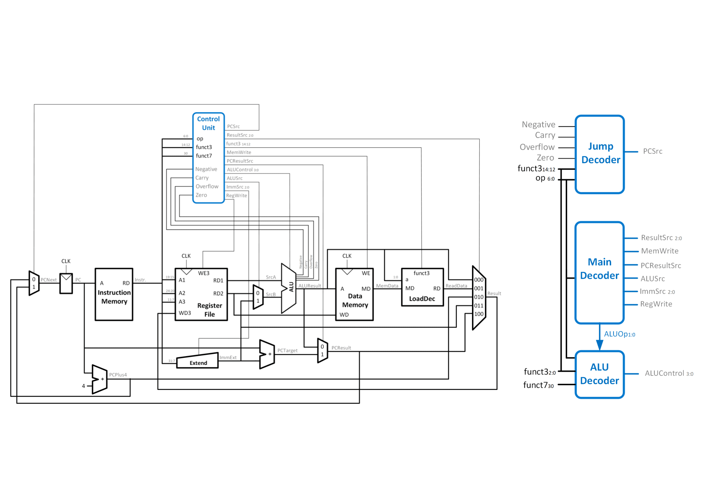
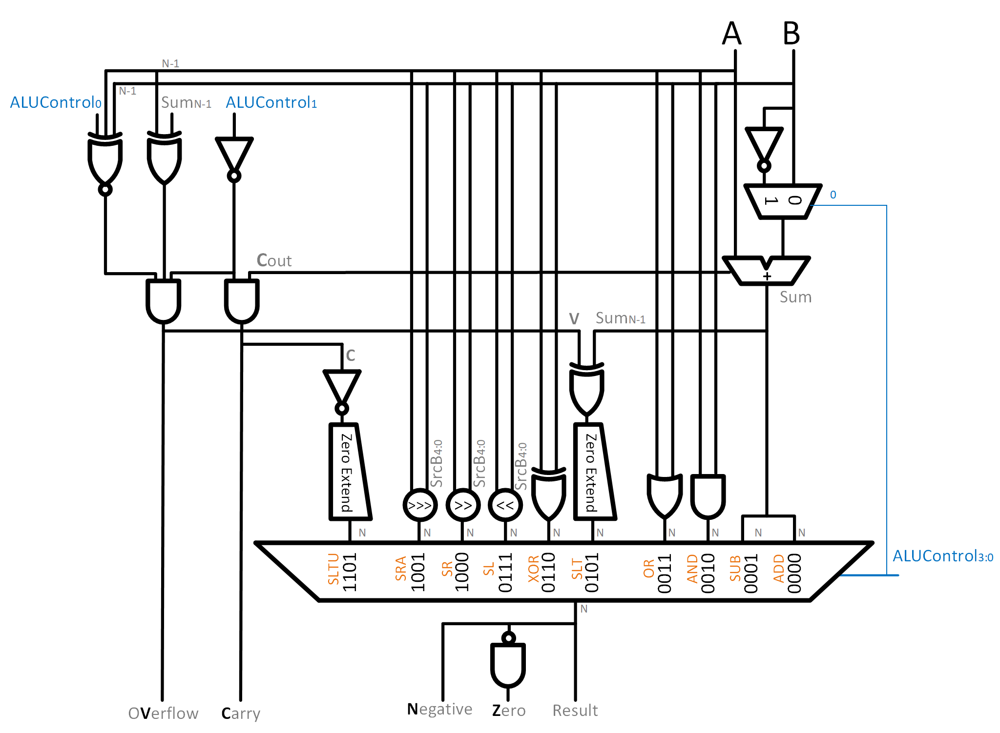

## Overview
It is intended to build:

- single cycle RISC-V processor;
- pipeline RISC-V processor;

## Tools
- Xilinx Vivado 2019.02
- [Online RISC-V Interpreter](https://www.cs.cornell.edu/courses/cs3410/2019sp/riscv/interpreter/)
- [Online RISC-V Assembler](https://riscvasm.lucasteske.dev/#)

## Setup
Firstly, clone the repo:
```
$ git clone git@github.com:TomasLAbreu/riscv-processor.git
$ cd riscv-processor/
```
Create the single-cycle-risc-v processor Vivado project:
```
$ cd single-cycle-risc-v/
$ vivado &
```
When Vivado opens, go to `Tools > Run Tcl Script...` and run **create_proj.tcl**.
**Enjoy**!

## Support Documents
- [RISC-V Instruction Set Specifications](https://msyksphinz-self.github.io/riscv-isadoc/html/index.html)
- [RISC-V Instruction Set Manual](https://github.com/TomasLAbreu/riscv-processor/blob/main/doc/riscv-spec-20191213.pdf)
- [RISC-V Instruction Set Summary](https://github.com/TomasLAbreu/riscv-processor/blob/main/doc/RISC-V-Instruction-Set-Summary.pdf)
- [RISC-V Reference Card](https://github.com/TomasLAbreu/riscv-processor/blob/main/doc/RISC-V_referenceCard.pdf)
- [Digital Design and Computer Architecture RISC-V Edition](https://github.com/TomasLAbreu/riscv-processor/blob/main/doc/Digital-Design-And-Computer-Architecture-RISC-V-Edition.pdf) - Chapter 7 (PDF pages 421-470)

# Single-cycle Processor

### Datapath and Control Unit Diagram


### ALU


Supported instructions:

**I Type**
- [x] lb
- [x] lh
- [x] lw
- [x] lbu
- [x] lhu
- [x] addi
- [x] slli
- [x] slti
- [x] sltiu
- [x] xori
- [x] srli
- [x] srai
- [x] ori
- [x] andi
- [x] jalr

---
**S Type**
- [x] sb
- [x] sh
- [x] sw

---
**R Type**
- [x] add
- [x] sub
- [x] sll
- [x] slt
- [x] sltu
- [x] xor
- [x] srl
- [x] sra
- [x] or
- [x] and

---
**U Type**
- [x] auipc
- [x] lui

---
**B Type**
- [x] beq
- [x] bne
- [x] blt
- [x] bge
- [x] bltu
- [x] bgeu

---
**J Type**
- [x] jal

-----
**Done by:**

- Tomás Abreu
- Diogo Fernandes
- Duarte Rodrigues
- João Miranda

Engenharia Eletrónica Industrial e Computadores @ Universidade do Minho, 2022
